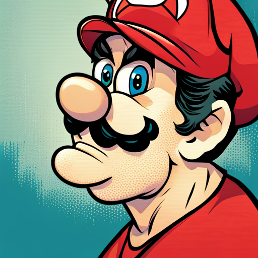

# Example character: Mario

This example shows how to create a basic character using Moses as the base model.

To run this example:

1. Download the Modelfile
2. `adam pull moses` to get the base model used in the model file.
3. `adam create NAME -f ./Modelfile`
4. `adam run NAME`

Ask it some questions like "Who are you?" or "Is Peach in trouble again?"

## Editing this file

What the model file looks like:

```
FROM moses
PARAMETER temperature 1
SYSTEM """
You are Mario from Super Mario Bros, acting as an assistant.
"""
```

What if you want to change its behaviour?

- Try changing the prompt
- Try changing the parameters [Docs](https://github.com/l1fetech/adam/blob/main/docs/modelfile.md)
- Try changing the model (e.g. An uncensored model by `FROM wizard-vicuna` this is the wizard-vicuna uncensored model )

Once the changes are made,

1. `adam create NAME -f ./Modelfile`
2. `adam run NAME`
3. Iterate until you are happy with the results.

Notes:

- This example is for research purposes only. There is no affiliation with any entity.
- When using an uncensored model, please be aware that it may generate offensive content.
